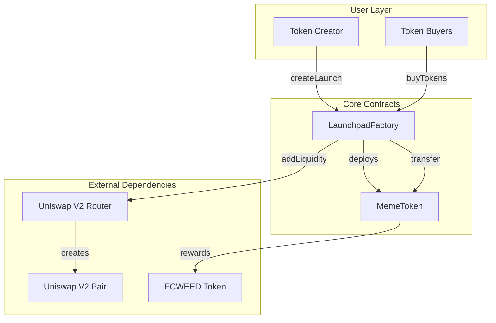

# High-Level Design Document

## System Overview

The Pump.fun-style Launchpad is a decentralized token launch platform that implements a two-phase mechanism for meme token creation and trading. The system combines bonding curve economics with automated DEX liquidity provision to create a fair and transparent launch process.

## Architecture

### Component Diagram



### Contract Relationships

1. **LaunchpadFactory**: Central orchestrator
   - Deploys MemeToken instances
   - Manages bonding curve logic
   - Handles DEX graduation
   - Collects platform fees

2. **MemeToken**: ERC20 with tax mechanism
   - Standard ERC20 functionality
   - 3% transfer tax
   - FCWEED reward distribution
   - Configurable exemptions

3. **Uniswap V2 Integration**: DEX liquidity
   - Router for liquidity operations
   - Factory for pair creation
   - Pair for LP token management

## Two-Phase Launch Mechanism

### Phase 1: Bonding Curve

**Objective**: Fair price discovery and liquidity collection

**Mechanics**:
1. Users send ETH to buy tokens
2. Price calculated via linear bonding curve
3. Each purchase increases price
4. No selling allowed
5. ETH accumulated for liquidity

**Bonding Curve Formula**:
```
price = INITIAL_PRICE + (tokensSold / 10^18) * PRICE_INCREMENT
```

**Example**:
- Initial price: 0.00001 ETH per token
- After 100M tokens sold: 0.0001 ETH per token
- Linear increase ensures predictable pricing

**Market Cap Tracking**:
```
marketCap = totalRaised
graduationThreshold = 69 ETH
```

### Phase 2: DEX Trading

**Objective**: Provide permanent liquidity and enable free trading

**Graduation Trigger**:
- Automatic when `totalRaised >= GRADUATION_MARKET_CAP`
- Manual by owner (emergency)

**Graduation Process**:
1. Calculate platform fee (1% of raised ETH)
2. Calculate liquidity amounts:
   - ETH: `totalRaised - platformFee`
   - Tokens: `TOTAL_SUPPLY - tokensSold`
3. Approve router for token spending
4. Add liquidity to Uniswap V2
5. Burn LP tokens to dead address
6. Remove tax exemption for launchpad
7. Transfer token ownership to creator
8. Mark launch as graduated

**Liquidity Lock**:
- LP tokens sent to `0x000000000000000000000000000000000000dEaD`
- Permanent lock (cannot be recovered)
- Ensures long-term liquidity availability

## Tax Mechanism

### Tax Collection

**When Applied**:
- All transfers between non-exempt addresses
- Both Phase 1 and Phase 2 (after graduation)

**Exemptions**:
- Minting (address(0) → user)
- Burning (user → address(0))
- Launchpad contract (during Phase 1)
- Owner address
- Custom exemptions set by owner

**Calculation**:
```solidity
taxAmount = (transferAmount * taxPercentage) / BASIS_POINTS
amountAfterTax = transferAmount - taxAmount
```

**Example** (3% tax):
- Transfer: 1000 tokens
- Tax: 30 tokens (3%)
- Received: 970 tokens

### Tax Distribution

**Collection**:
- Tax tokens held in MemeToken contract
- Tracked via `totalTaxCollected`

**Distribution**:
- Owner calls `distributeTaxRewards()`
- Provides FCWEED amounts for each holder
- Proportional to holdings or custom logic
- Requires owner to have FCWEED balance

**Flow**:
```
User A → User B (1000 tokens)
  ↓
Tax collected (30 tokens) → MemeToken contract
  ↓
Owner distributes FCWEED rewards
  ↓
FCWEED → Token holders
```

## Security Design

### Access Controls

**Owner-Only Functions**:
- `setTaxPercentage()`: Update tax rate
- `setFcweedToken()`: Change reward token
- `setTaxExempt()`: Manage exemptions
- `setPlatformFee()`: Update platform fee
- `graduateToDex()`: Manual graduation
- `emergencyWithdraw()`: Emergency recovery

**Public Functions**:
- `createLaunch()`: Anyone can create
- `buyTokens()`: Anyone can buy
- `transfer()`: Standard ERC20

### Reentrancy Protection

**ReentrancyGuard Applied**:
- `createLaunch()`
- `buyTokens()`
- `graduateToDex()`
- `distributeTaxRewards()`

**Pattern**:
```solidity
function buyTokens() external payable nonReentrant {
    // 1. Checks
    require(launch.active, "Launch not active");
    
    // 2. Effects
    launch.totalRaised += cost;
    launch.tokensSold += tokenAmount;
    
    // 3. Interactions
    token.transfer(msg.sender, tokenAmount);
    msg.sender.call{value: refund}("");
}
```

### Input Validation

**Parameter Checks**:
- Non-zero addresses
- Valid amounts
- Within limits (max tax, max fee)
- Array length matching

**State Checks**:
- Launch active/graduated status
- Sufficient balances
- Deadline validation

## Economic Model

### Token Distribution

**Total Supply**: 1,000,000,000 (1B tokens)

**Allocation**:
- 80% (800M): Bonding curve sales
- 20% (200M): Liquidity reserve

**Rationale**:
- Large supply for bonding curve ensures fair distribution
- Reserve provides deep liquidity post-graduation

### Fee Structure

**Platform Fee**: 1% (100 basis points)
- Collected from raised ETH
- Paid to launchpad owner
- Funds platform operations

**Transfer Tax**: 3% (300 basis points)
- Collected on all transfers
- Distributed as FCWEED rewards
- Incentivizes holding

### Price Discovery

**Bonding Curve Advantages**:
- Transparent pricing
- No front-running
- Fair for all participants
- Predictable market cap

**DEX Trading Advantages**:
- Free market pricing
- Immediate liquidity
- Composability with DeFi
- Standard trading experience

## Upgrade Path

### Current Limitations

**Non-Upgradeable**:
- Contracts are immutable
- Parameters fixed at deployment
- No proxy pattern

**Configurable Elements**:
- Tax percentage (0-10%)
- Platform fee (0-5%)
- FCWEED token address
- Tax exemptions

### Future Enhancements

**Potential Upgrades** (would require new deployment):
1. **Advanced Bonding Curves**
   - Exponential curves
   - Custom curve parameters
   - Dynamic pricing

2. **Multi-DEX Support**
   - SushiSwap integration
   - PancakeSwap for BSC
   - Multiple liquidity pools

3. **Enhanced Tax Distribution**
   - Automatic FCWEED distribution
   - Reflection mechanism
   - Staking rewards

4. **Governance**
   - DAO-controlled parameters
   - Community voting
   - Decentralized ownership

## Testing Strategy

### Unit Tests

**MemeToken.test.js**:
- Deployment and initialization
- Tax calculation and collection
- Tax exemption management
- FCWEED reward distribution
- Edge cases and error handling

**LaunchpadFactory.test.js**:
- Launch creation
- Bonding curve purchases
- Price calculation
- DEX graduation
- Platform fee collection
- Access controls

### Integration Tests

**Integration.test.js**:
- Complete launch lifecycle
- Multiple concurrent launches
- Fee distribution verification
- Security scenarios
- Reentrancy protection

### Test Coverage Goals

- **Line Coverage**: >95%
- **Branch Coverage**: >90%
- **Function Coverage**: 100%

## Deployment Considerations

### Network Selection

**Mainnet**:
- High gas costs
- Maximum security
- Largest user base

**L2 Solutions** (Arbitrum, Optimism):
- Lower gas costs
- Fast transactions
- Growing ecosystems

**BSC**:
- Low gas costs
- Large DeFi ecosystem
- PancakeSwap integration

### Pre-Deployment Checklist

- [ ] Security audit completed
- [ ] All tests passing
- [ ] Gas optimization reviewed
- [ ] FCWEED token deployed
- [ ] Router addresses verified
- [ ] .env configured correctly
- [ ] Deployment script tested on testnet
- [ ] Emergency procedures documented

### Post-Deployment

1. **Verification**
   - Verify on Etherscan
   - Publish source code
   - Document ABIs

2. **Monitoring**
   - Track launches
   - Monitor graduations
   - Watch for anomalies

3. **Communication**
   - Announce deployment
   - Publish documentation
   - Provide support channels

## Risk Analysis

### Smart Contract Risks

**High Risk**:
- Reentrancy attacks → Mitigated with ReentrancyGuard
- Integer overflow → Mitigated with Solidity 0.8+
- Access control bypass → Mitigated with Ownable

**Medium Risk**:
- Front-running → Partially mitigated by bonding curve
- Price manipulation → Limited by linear curve
- Liquidity fragmentation → LP tokens burned

**Low Risk**:
- Gas optimization → Acceptable costs
- Upgrade path → Documented limitations

### Economic Risks

**Market Risks**:
- Low demand for launches
- Insufficient buyers
- Price volatility

**Mitigation**:
- Low graduation threshold (69 ETH)
- Fair bonding curve pricing
- Permanent liquidity lock

### Operational Risks

**Owner Risks**:
- Key compromise
- Malicious owner actions
- Centralization concerns

**Mitigation**:
- Multi-sig recommended
- Timelock for parameter changes
- Community oversight

## Conclusion

The Pump.fun-style Launchpad provides a robust, secure, and fair mechanism for launching meme tokens. The two-phase approach ensures price discovery through bonding curves while guaranteeing permanent liquidity via DEX integration. The tax mechanism creates ongoing value for holders through FCWEED rewards.

Key strengths:
- ✅ Fair launch mechanism
- ✅ Permanent liquidity
- ✅ Holder rewards
- ✅ Security-focused design
- ✅ Comprehensive testing

The system is production-ready pending professional security audit and thorough testnet validation.
